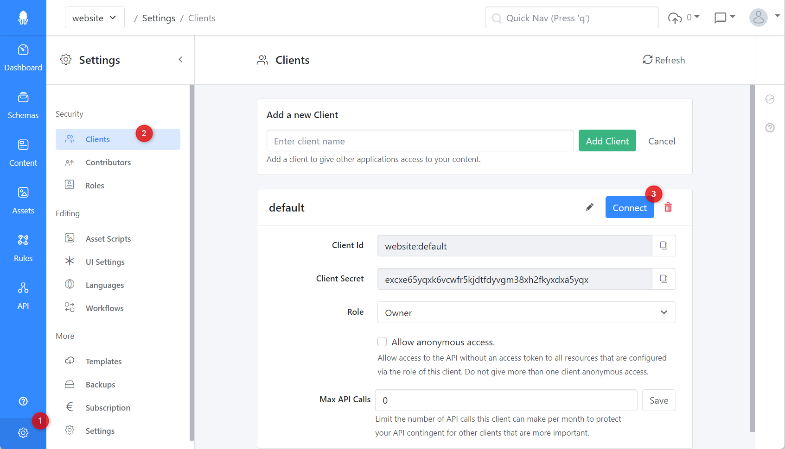

# .NET Standard

## Introduction

The SDK is mostly generated from the OpenAPI specification. You can read the API docs at[ https://cloud.squidex.io/api/docs](https://cloud.squidex.io/api/docs).

This means that the API is fully covered, including all endpoints used by the frontend. You can also use the SDK to create and configure apps, schemas and rules.

The downside is that some of the methods are not as user friendly as they could be. Most methods have the app name as a required parameter, which is redundant because the SDK is designed to mainly connect to a single app anyway and has the app name as a global configuration option.

This has been changed with **v15.0.0** and the developer experience has been improved. Therefore this document includes the difference between version 15 and the previous versions.&#x20;

## Generating content classes

Because of localization, the OpenAPI specification and the generated classes are very difficult to use, especially if your fields are not localized. Therefore we recommend to create the mapping classes for your schemas manually. Of course you can also use OpenAPI to generate them.

Our recommendation is to use [NSwag](https://github.com/RicoSuter/NSwag). The code generator is also available as a class library to automate the code generation in your CI pipeline.

## Install the SDK

The SDK is available on [nuget.org](https://www.nuget.org/packages/Squidex.ClientLibrary/). You can install it with:

```bash
dotnet add package Squidex.ClientLibrary
```

If you use [Dependency Injection](https://learn.microsoft.com/en-us/aspnet/core/fundamentals/dependency-injection?view=aspnetcore-7.0) (especially in ASP.NET Core) you can use the following package:

```bash
dotnet add package Squidex.ClientLibrary.ServiceExtensions
```

## Instantiate the SDK

As described above, the SDK has been improved with version 15. Therefore it is recommended to read one of the following pages depending on the installed version of the package.


[version-v15-and-later.md](version-v15-and-later.md)



[version-v14-and-earlier.md](version-v14-and-earlier.md)


### Get the code from the Management UI

You can get the initialization code directly from the Management UI. Follow the steps below to do so.

* (1) Go to **Settings**.
* (2) Go to **Clients**.
* (3) Click the **Connect** button.

<figure><figcaption><p>Client settings for your app</p></figcaption></figure>

Next click on the third link titled **Connect to your App with SDK** to get instructions.

<figure><figcaption><p>The Connect wizard for you app client</p></figcaption></figure>

On the next screen, copy and paste the sample code applicable for your version to the source file.

<figure><figcaption><p>The sample code for the client manager</p></figcaption></figure>

## How to work with content items?

Working with contents requires more work.

### Why no code generation?

The reason is, the JSON structure of the content data. Lets assume we have a `blog-post` schema with two fields: a localized `title` field and a normal (invariant) `slug` field. The resulting content response would look like the following example:

```javascript
{
   "title": {
      "en": "Hello Squidex",
      "de": "HALLO Squidex"
   },
   "slug": {
      "iv": "hello-squidex"
   }
}
```

When you map a structure to a C# class every JSON object is mapped to either a dictionary or a class.

A code generator would then create the following class structure and would convert all JSON property names to a Pascal-Case naming to align the naming with the C# conventions. So whenever you work with invariant fields you have to access the `Iv` property to get the value.

```csharp
public class BlogPostTitle {
    public string En { get; set; }
    public string De { get; set; }
}

public class BlogPostSlug {
    public string Iv { get; set; }
}

public class BlogPostData {
    public BlogPostTitle Title { get; set; }

    public BlogPostSlug Slug { get; set; }
}
```

This must be repeated for each field and would create a lot of code. Therefore it is better to create the content classes manually and use custom converters to let the JSON serializer deal with that.

### 1. Create your class model

For each schema two classes are needed.

The data object is the structure of your content data.

```csharp
public sealed class BlogPostData
{
    // The invariant converter converts the object to a flat property.
    [JsonConverter(typeof(InvariantConverter))]
    public string Slug { get; set; }

    // For localizable fields you can use dictionaries.
    [JsonPropertyName("my_title")]
    public Dictionary<string, string> Title { get; set; }
}
```

Another class is created for the blog post itself, which holds the data and metadata.

```csharp
public sealed class BlogPost : Content<BlogPostData>
{
}
```

#### How to map fields to .NET types

It depends on your field type i.e. which .NET type you use for a field.

The following is our recommendation.

| Field Type  | .NET Type                                         |
| ----------- | ------------------------------------------------- |
| Assets      | `System.Collections.Generic.List<System.Guid>`    |
| Boolean     | `bool`                                            |
| DateTime    | `System.DateTime` or `System.DateTimeOffset`      |
| Geolocation | A custom class.                                   |
| Json        | `Newtonsoft.Json.Linq.JObject` or a custom class. |
| Number      | `double`                                          |
| References  | `System.Collections.Generic.List<System.Guid>`    |
| String      | `string`                                          |
| Tags        | `System.Collections.Generic.List<Sstring>`        |
| Array       | A custom class.                                   |

#### Geolocation classes

At the moment the SDK does not provide a ready to use structure for geolocations, but you can use the following class:

```csharp
public class Geolocation 
{
    public double Latitude { get; set; }
    public double Longitude { get; set; }
}
```

#### Arrays

When you have an array field you need a class for your array items, for example:

```csharp
public class Comment 
{
    public string Author { get; set; }

    public string Text { get; set; }
}

public sealed class BlogPostData
{
    // For invariant array fields.
    [JsonConverter(typeof(InvariantConverter))]
    public List<Comment> Comments { get; set; }

    // For localized array fields.
    [JsonPropertyName("my_comments")]
    public Dictionary<string, List<Comment>> Comments  { get; set; }
}
```


Please note that the `InvariantConverter`is only needed for root fields.


### 2. Instantiate the client

#### Version 15 and above

Use the schema name and the created types as arguments.

```csharp
var blogPostsClient =
    client.Contents<BlogPost, BlogPostData>("blog-post");
```

The client is cached and therefore you can call this method as often as you want.

#### Version 14 and below

Use the schema name and the created types as arguments.

```csharp
var blogPostsClient =
    clientManager.CreateContentsClient<BlogPost, BlogPostData>("blog-post");
```

Do not recreate the client for every request as it is not cached in the client manager.

### 3. Use the client

Using the client is very easy, for example:

#### Get a content item by id

```csharp
var post = await blogPostsClient.GetAsync("10cb16da-60d2-4ff7-bd2c-47d724a4798c");
```

#### Get a content item by id and version

```csharp
var post = await blogPostsClient.GetAsync("10cb16da-60d2-4ff7-bd2c-47d724a4798c", 4);
```

#### Create a new content item

```csharp
var data = new BlogPostData
{
    Slug = "hello-squidex",
    Title = new Dictionary<string, string>
    {
        ["en"] = "Hello Squidex",
        ["de"] = "Hallo Squidex"
    }
};

await blogPostsClient.CreateAsync(data);
```

#### Update a content item

```csharp
var data = new BlogPostData
{
    Slug = "hello-squidex",
    Title = new Dictionary<string, string>
    {
        ["en"] = "Hello Squidex",
        ["de"] = "Hallo Squidex"
    }
};

await blogPostsClient.UpdateAsync("10cb16da-60d2-4ff7-bd2c-47d724a4798c", data);
```

#### Query items by filter

```csharp
var posts = await blogPostsClient.GetAsync(new ContentQuery
{
    Filter = $"data/slug/iv eq '{slug}'"
});
```

## More samples

We also use the .NET client for API tests. They do not cover all endpoints yet, but are a helpful reference.

[https://github.com/Squidex/squidex/tree/master/tools/TestSuite](https://github.com/Squidex/squidex/tree/master/tools/TestSuite)
