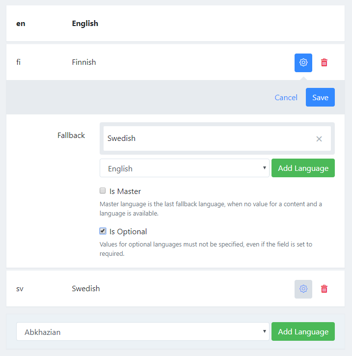

# Localization

Localization allows you to define content in multiple languages.

## Basic concept

You can define per field if the field is localizable or not. We call this system partitioning, but more about that later.

It is easy to understand when you have a look to an content object from the API:

```json
{ 
    "id": "01",
    "created": "2017-02-25T19:56:35Z",
    "createdBy": "...",
    "lastModified": "2017-02-25T19:56:35Z",
    "lastModifiedBy": "...",
    "data": {
        "name": {
            "en": "Copenhagen",
            "sv": "Köpenhamn",
            "fi": "Kööpenhamina",
        },
        "population": {
            "iv": 1400000
        }
    }
}
```

Each field value is a set of values that are associated to keys. In javascript it is called a `object`, other programming langauges call it `HashMap` or `Dictionary`. The keys must be unique. Depending whether the field is localizable or not the API accepts different keys.

* The `population` field is not localizable. Therefore the only allowed key is `iv`, which stands for "invariant".
* The `name` field is localizable. The allowed keys are the language codes for the languages you have configured.

The languages an fallback rules can be configured in the Management UI:



In this example we have 3 languages:

1. **English (en)**: Our master language. Whenever a fields is not available in a language it falls back to the master language.
2. **Finnish (fi)**: Our newest language. It fallsback to swedish. This means that whenever a value for a localizable fields is not available Squidex tries to resolve the value from swedish first and then from the master language (English). Finish is also marked as optional, which mean that required fields can be omitted. This is useful when you introduce a new language. You can save contents with required fields even if the field value has not been entered for the optional language.
3. **Swedish (sv)**: One of our main langauges which falls back to to master language (english).

## How to retrieve the correct languages?

The rest endpoint provides two headers that can be used to query the correct language.

### X-Languages Header

You can filter the languages with the `X-Languages` header. Other languages will be omitted. We do not use the `Accept-Language` header because we want to avoid compatibility issues. If you define a language that is not supported, this language will be ignored. For example: If you set: `X-Languages: en,sv,de` for our example above you will only retrieve English (en) and Swedish (sv). 

```json
X-Languages: en,sv
{ 
    ...,
    "data": {
        "name": {
            "en": "Copenhagen",
            "sv": "Köpenhamn"
        },
        "population": {
            "iv": 1400000
        }
    }
}
```

If none of the specified languages is provided you will retrieve the master language only.

```json
X-Languages: de
{ 
    ...,
    "data": {
        "name": {
            "en": "Copenhagen"
        },
        "population": {
            "iv": 1400000
        }
    }
}
```

### X-Flatten Header

If you add this header, fields that only have a single value will be flattened. So the example above will be transformed to:

```json
X-Flatten: true
{ 
    ...,
    "data": {
        "name": {
            "de": "Copenhagen",
            "sv": "Köpenhamn"
        },
        "population": 1400000
    }
}
```

Both headers can be combined. If you define a single language with the `X-Languages` header the localizable fields will contain only one value each and therefore they can be flattened as well. If you provide an unsupported language you will just get the master language.

So our example from above might look like:

```json
X-Languages: de
X-Flatten: true
{ 
    ...,
    "data": {
        "name": "Copenhagen",
        "population": 1400000
    }
}
```

It basically means that you can just forward the user language and Squidex will handle the rest.

> NOTE: The headers above are not supported by the graphql endpoint, because in graphql the output should be defined the query only

## Why do you call it partitioning?

It basically means that the a value is partitioned into multiple subvalues. When we implemented the localization feature we realized that it might be very helpful to extend this feature to other type of keys, for example you could...

* ... define your prices for different currencies.
* ... write your texts for different countries.
* ... define customer groups.

So we implemented the localization feature with the idea in mind that we might extend it in coming versions.
