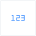

# Schemas

Schemas define the structure of your content.

You have to publish your schema before you can create content.

## Field States

Each field has multiple states:

1. **Locked**: The field cannot be updated or deleted.
2. **Hidden**: The field will not be returned by the api and only visible in the Management UI.
3. **Disabled**: The field cannot be manipulated in the Management UI. Do not use it together with the required operator, because you will not be able to create or update content items anymore.

## Field Types

Field types define how a field is structured in the API and in the processing pipeline. You can define the editor for each field, so a string field can either be a html text, markdown or a list of allowed values with a dropdown editor. We use a product catalog as an example to describe the different field types.

 If a field is not required it can also be null or omitted.

### String


A string is the most used field type and can be used for any kind of texts, like product names, descriptions and additional information. It is also the most flexible field and the usage depends very much on the editor you are using:

1. **HTML**: With a wysiwyg editor.
2. **Markdown**: With a markdown editor.
3. **Singleline text**: With an input control.
4. **Multiline text**: With a textarea control.
5. **Selection of predefined values**: With a dropdown control or radio boxes.

#### API representation

```json
{
    "name": "Squidex T-Shirt",
    "description": "For our fans. <p>Available in <strong>multiple colors ..."
}
```

### Number



A number can either be a point number or integer. Typical examples when to use numbers are quantities, IDs and prices.

#### API representation

```json
{
    "quantity": 100,
    "price": 9.99
}
```

### Boolean


Booleans have only 2 states: True or false, yes or no, 1 or 0.

#### API representation

```json
{
    "isSoldOut": true,
    "isOffer": null
}
```

### DateTime


Date and time in the ISO8601 standard. The format is: `YYYY-MM-DDTHH:mm:ss.sssZ`.

#### API representation

```json
{
    "sellUntil": "2020-02-02T12:00:00Z"
}
```

### Assets


Asset fields are used to maintain a list of assset IDs. You can also restrict the number of assets with a minimum and maximum limit, for example when you want to have a single avatar or preview image for a content. You can use the IDs load the asset. Read more about [here](../06-guides/05-assets.md). When you delete an asset a cleanup process will remove the asset id from your contents. This process is executed in the background to improve the performance and it can take several minutes to complete. Therefore it is highly recommended to handle cases where an content has an id to an deleted asset.

#### API representation

```json
{
    "images": [
        "7722daf6-1ba7-4b2a-a5bb-fc57e22f5645",
        "b666b172-9918-4764-ac26-300ba4857d5f"
    ]
}
```

### References & Array


References fields are used to model relationship to other content items. For example you could have a schema for products and a schema for product categories. A product has a field with references to the categories it belongs to. Both, products and categories can be created, updated and managed independently. Please think about the direction of the reference very carefully. For example a typical product is only in very few categories, but a product category could have thousand of products. Therefore it is not recommended to reference the products from the categories. When you delete an content a cleanup process will remove the referenced id from all contents. This process is executed in the background to improve the performance and it can take several minutes to complete. Therefore it is highly recommended to handle cases where an content has an reference to an deleted content.

#### API representation

```json
{
    "categories": [
        "7722daf6-1ba7-4b2a-a5bb-fc57e22f5645",
        "b666b172-9918-4764-ac26-300ba4857d5f"
    ]
}
```

### Array


Some content items only exist as child content for another content item. For example a product could have variations like different sizes and prices. These content items can be represented with array fields, where each item in the field has a specified structured, that is called `nested schema`. 

#### API representation

```json
{
    "sizes": [{
        "size": "XL",
        "quantity": 100,
        "price": 30
    }, {
        "size": "L",
        "quantity": 100,
        "price": 28.5
    }]
}
```

### Geolocation


The geolocation field represents a tuple of latitude and longitude and is designed to be used in combination with maps. It does not store additional data about the location, such as names, addresses or other information. You have to add additional fields for this purpose.

```json
{
    "location": {
        "latitude": 14.9212444,
        "longitude": 57.2121432
    }
}
```

### Tags


Tags are list of strings that are use in the combination tag editor in the Management UI. It is especially useful if you enrich your content with external systems. At the moment the tag editor does not support advanced tag management, such as global lists of tags, renaming and merging of tags.

#### API representation

```json
{
    "tags": [
        "t-shirts",
        "fan-products"
    ]
}
```

### Json


A json field is for developers. Whenever you have some structured or unstructured content, that you cannot cover with the built in field types or editors you should the json field. You should either write a [custom editor](../06-guides/07-custom-editors.md) when the content editors can edit the field or disable the field when the content for this field comes from an external source. Editing the json manually is fragile and can easily break your processes.

#### API representation

```json
{
    "sold": {
        "Europe": {
            "Germany": {
                "quantity": 100,
                "averagePrice": 15.44
            }
        }
    }
}
```