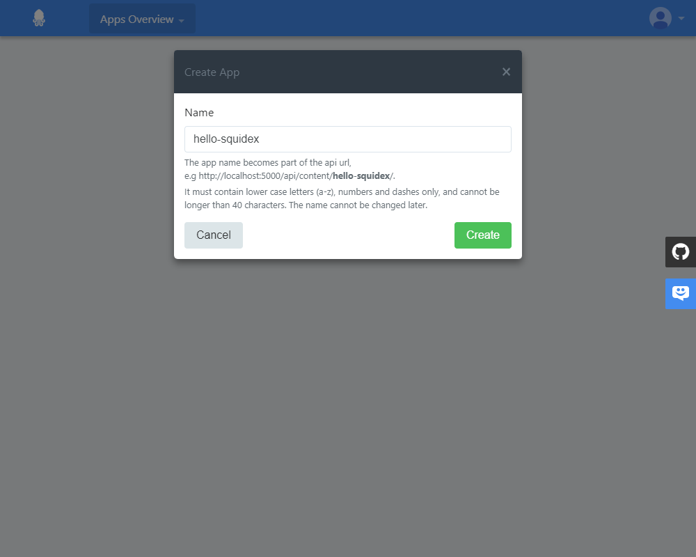
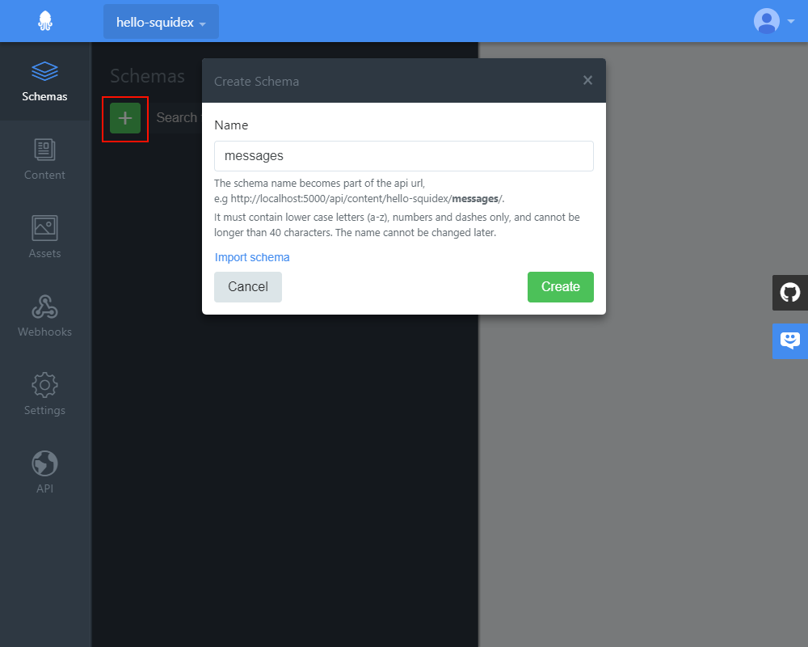
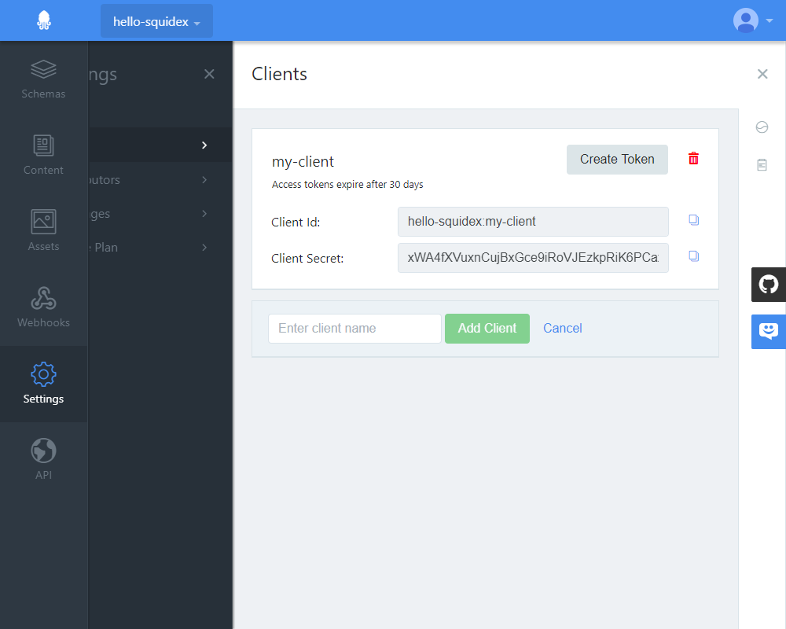
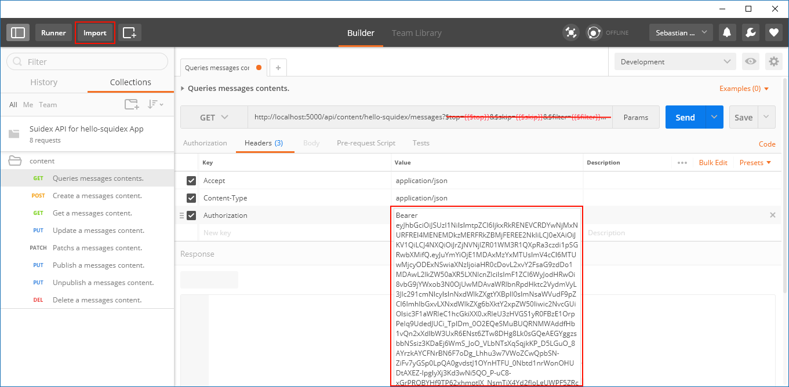

# Getting started with Postman

This is a short tutorial how to make the first requests with postman.

## 1. Create an App

The first step is to create an application. Choose a name of your choice.

## 2. Create a Schema

Next create a schema. In this example we added a single field. 

Ensure that the schema is published. Otherwise you cannot create content for the schema.

## 3. Add Content

Add some content to your schema.

## 4. Create a Client

Create a client for each application. Choose a name.

We have implemented the OpenID client credentials flow: https://docs.axway.com/u/documentation/api_gateway/7.5.3/webhelp_portal_oauth/Content/OAuthGuideTopics/oauth_flows_client_credentials.htm to make requests.

You have to make a request to get an authentication token. This token is valid for 30 days:

    $ curl
        -X POST 'http://localhost:5000/identity-server/connect/token/' 
        -H 'Content-Type: application/x-www-form-urlencoded' 
        -d 'grant_type=client_credentials&
            client_id=[APP_NAME]:[CLIENT_ID]&
            client_secret=[CLIENT_SECRET]&
            scope=squidex-api'

For now we just use the 'Create Token' button to get the access token.

## 5. Download Swagger Specification

Open the API documentation under *API\Swagger* and download the swagger specification:

## 6. Make the request with Postman

1. Open Postman
2. Import the Swagger specification (just ignore the errors).
3. Open the collection for your app and use the Query-request.
4. Just delete the query strings for now.
5. Add an authorization header and copy the access token from Step4.

