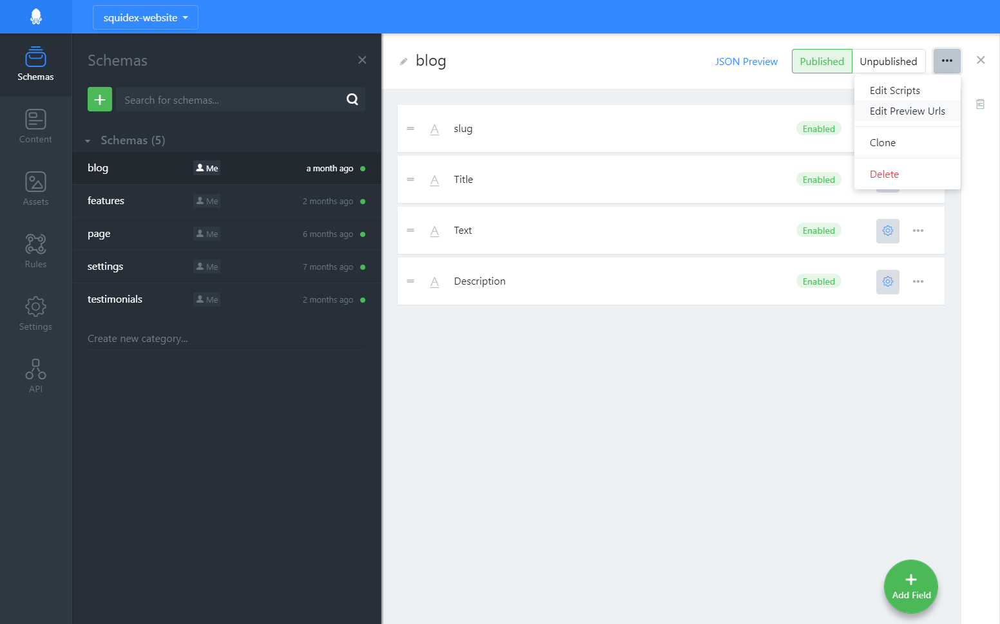
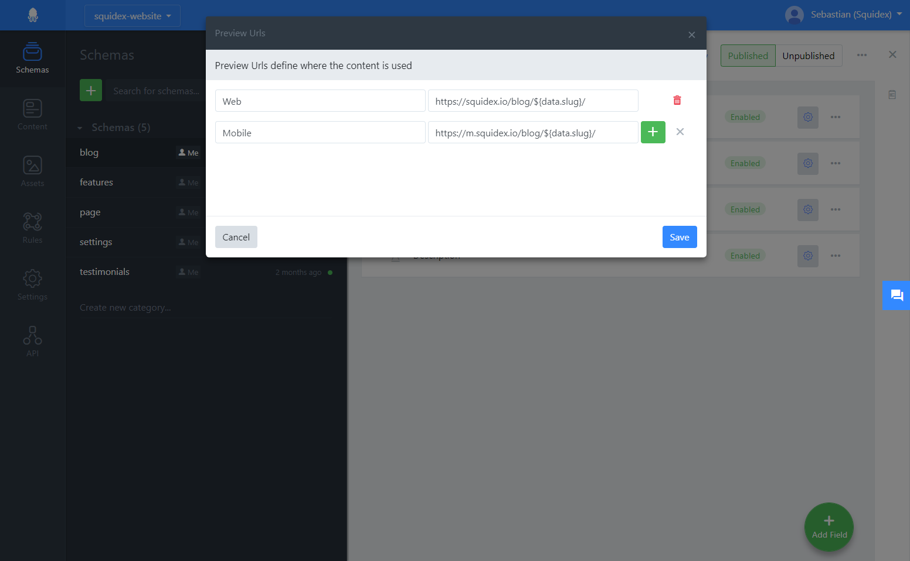

# Preview content

By default, Squidex will only deliver content that has been published. But it can be very useful to review content in your production environment before you actually publish it. This guide shows you how to do it.

## Step 1: Query unpublished content in your application

To retrieve unpublished content you can add the `X-Unpublished` header to all your Http Requests to the Squidex API. For the website I have added a top secret query parameter to the blog page. When this query parameter is set to true, it will create add this header to the requests.

The following example shows how you can do it with the C# client library:

```csharp
public BlogPost Post { get; set; }

public async Task<IActionResult> OnGet(string slug, bool secretQueryParameter = false)
{
    var postsClient = clientManager.GetClient<BlogPost, BlogPostData>("blog");
    
    var context = QueryContext.Default.Unpublished(secretQueryParameter);

    var posts = await postsClient.GetAsync(filter: $"data/slug/iv eq '{slug}'", context);
    var post = pages.Items.FirstOrDefault();

    if (post == null)
    {
        return NotFound();
    }
    
    Post = post;

    return Page();
}

```


## Step2: Manage preview urls

You can define preview urls per schema in the following menu item:



In the dialog you can define as preview urls as you want. The following example shows 2 preview urls:

1. The url to the normal website.
2. The url to an dedicated mobile website (just as an example).

As you can see, you can use a placeholder with the javascript interpolation syntax, e.g.

1. `${id}` of the content.
2. `${data.slug}`: Slug field (if not localized).
3. `${data.slug.iv}`: Slug field, alternative syntax.
4. `${data.title.en}`: Title in English
5. `${data.title.en-US}`: Title in American English
6. `${version}`: Version of the content item.




## Step 3: Use the preview button to go the corresponding URL:

If you open a saved content item, you will see the buttons with the preview urls:

